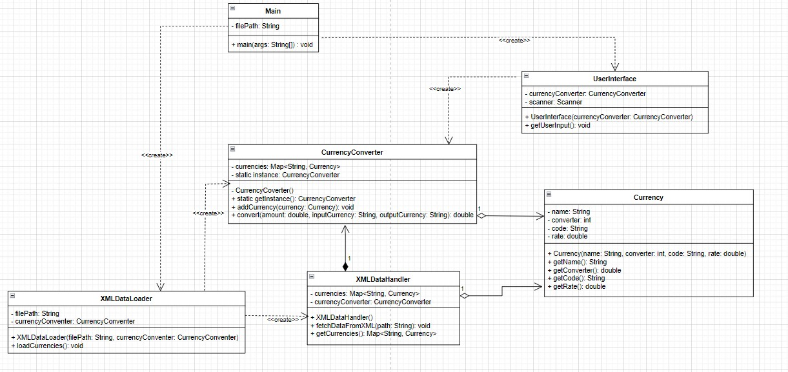

# Design patterns
Knowledge Simple examples of desingn patterns implemented just for practing them.

# List of implemented design patterns

C#
- Singleton
- Iterator
- Abstract factory

## [Vector operations](./Decorator&Adapter/)

C#

- Decorator
- Adapter

This project aims to illustrate the differences between using inheritance and design patterns to extend functionality

        

## [Currency exchange](./CurrencyExchanger/)

C#

- **Singleton**: Ensures a class has only one instance and provides a global point of access to it.
- **Factory Method**: Defines an interface for creating an object, but lets subclasses alter the type of objects that will be created.
- **Dependency Injection**: A design pattern in which an object receives other objects that it depends on, making the code more modular and testable.
- **Facade**: Provides a simplified interface to a complex subsystem.

## [Snake game](./Snake_multiple_dp/)

Java

### Singleton Pattern

- **Score Class**: Ensures only one instance of the score tracker exists throughout the game.
- **Grid Class**: Manages the game grid as a single instance to maintain consistent game state.
- **Main Window Class**: Controls the main game window with a single instance for UI management.
- **Keyboard Handler Class**: Manages keyboard input consistently with a single instance.

### Strategy Pattern

- **Snake Speed**: Allows dynamic changes to the snake's speed algorithm, enabling different speed strategies.

### Command Pattern

- **Game Restart**: Implements the game restart functionality as a command, enabling easy invocation and management.

### State Pattern

- **Snake Movement**: Manages the snake's movement states, allowing changes in behavior based on the snake's state.

### MVC Pattern

- **Whole Game Composition**: Structures the game into Model (game logic), View (UI), and Controller (input handling) to separate concerns and enhance maintainability.

